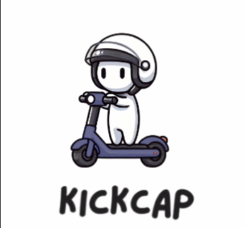
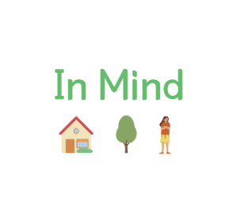
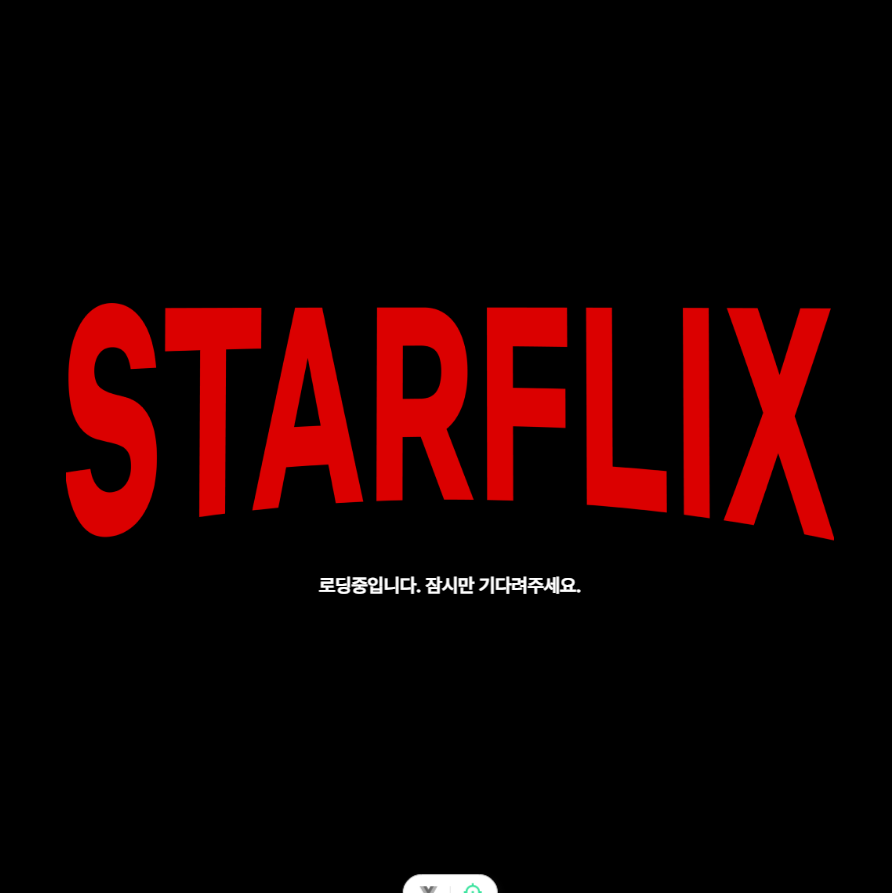

 

## 👋 Welcome
안녕하세요! 협력하고 개선하는 개발자 유현진입니다.

사람들과의 협력과 소통을 통해 더 나은  서비스를 개발하기 위해 적절한 기술을 찾고, 이를 적용하기 위해 여러 기술들을 끊임없이 학습하고 있습니다. 

사람들이 이해할 수 있도록 명세서 및 설계도를 작성하고, 유지보수가 용이한 코드를 작성하기 위해 항상 고민하고 있습니다.

## 🎓Educations 
- **2024.01 ~ 2024.12** 삼성 청년 SW 아카데미(SSAFY) 11기 자바 전공 트랙 수료
- **2017.03 ~ 2022.02** OO대학교 소프트웨어공학과 졸업

## 💼 Experience
- **2022.07 ~ 2022.12** OO대학교 병원 전산정보과 계약직
  - 병원 시스템 개발 및 유지보수 (구매재고/의료장비)

## 👨‍💻 Projects
|||||
| :-----------------------------------------: | :-------------------------------------------: | :----------------------------------------: | :----------------------------------------: |
|[ModuCare](https://github.com/1hyunjin/ModuCare)|[KICKCAP](https://github.com/1hyunjin/KICKCAP)|[InMind](https://github.com/1hyunjin/inMind)|[StarFlix](https://github.com/1hyunjin/starFlix)|              
|24.10 ~ 24.11|24.08 ~ 24.10|24.07 ~ 24.08|24.05 ~ 24.05|
|IoT, BE, AI|BE|BE, Algorithm|BE|
|두피 탈모 케어 서비스|킥보드 자동 단속 서비스|아동 HTP 심리상담 서비스|별명소 제공 서비스|

## 🏆Awards
2024.11 삼성 청년 SW 아카데미 11기 자율 프로젝트 우수상(1위)

## 🏅 Certification

- **2024.06**      SQLD
- **2023.05**      OPIc IM2(InterMediate MID)
- **2020.11**        정보처리기사

## 🛠️ Skills

### Languages & Frameworks
 

 

### Database

### SubStack

### Collaboration & Tools

<!--
**1hyunjin/1hyunjin** is a ✨ _special_ ✨ repository because its `README.md` (this file) appears on your GitHub profile.

Here are some ideas to get you started:

- 🔭 I’m currently working on ...
- 🌱 I’m currently learning ...
- 👯 I’m looking to collaborate on ...
- 🤔 I’m looking for help with ...
- 💬 Ask me about ...
- 📫 How to reach me: ...
- 😄 Pronouns: ...
- ⚡ Fun fact: ...
-->
